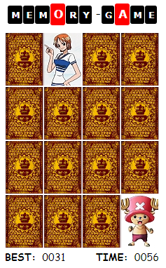

vue-memory-game
================

This project was bootstrapped with [Nuxt.JS](https://nuxtjs.org/).

## Objective
This is my third project for [Vue.Js](https://vuejs.org/).

Basically, I am trying to practice transitions which I find interesting.

## Description
> Please note that I do not own the images used. I just took them from the web.



This is inspired by this [github.com/leftstick/vue-memory-game](https://github.com/leftstick/vue-memory-game).

This is just a quick practice exercise.
Nothing that impressive.

I added timer and best time display from the last edit.

## Project setup
```
npm install
```

### Compiles and hot-reloads for development
```
npm run dev
```

Runs the app in the development mode.<br>
Open [http://localhost:3000](http://localhost:3000) to view it in the browser.

The page will reload if you make edits.<br>
You will also see any lint errors in the console.
